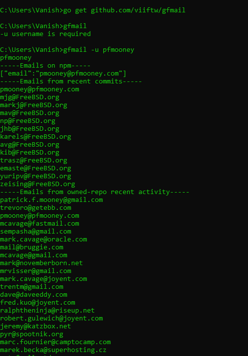

# go-find-emails (gfmail)
Retrieve user's emails from Github, NPM.
### Note
For unauthenticated requests, the rate limit allows for up to 60 requests per hour [Check documentation](https://developer.github.com/v3/#rate-limiting)


### Install
```sh
go get github.com/viiftw/gfmail
```

### Use
```sh
gfmail -u [username]
```


### Have inspiration from
[github-email](https://github.com/paulirish/github-email)